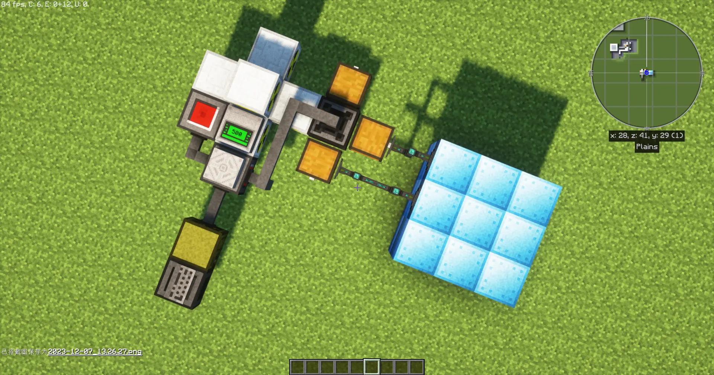
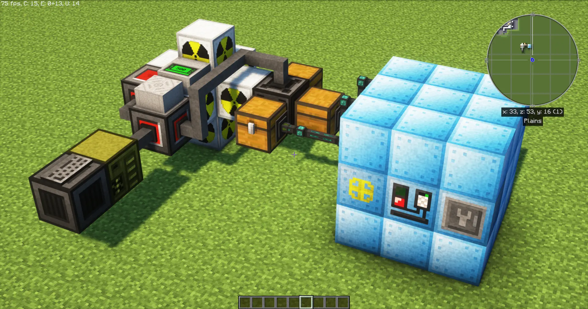

# GTNH-ICReactorWhithOC

GTNH 使用 OpenComputers mod 全自动控制工业核电，有以下功能：

* 冷却单元自动循环，需要准备冷却措施（例如真空冷冻机）
* 检测备用冷却单元是否足够，强制保证核反应堆的冷却单元布局
* 能量存储站给 OC 提供满能量信号可以关闭核电
* 温度监控报警，堆温超过阈值自动停止
* 支持同时控制多套核反应堆

## 使用

### 提前准备

* **OC**: 一台能运行的电脑，转运器，红石 I/O 端口，线缆
* **NC2**: 温度监控器，蜂鸣报警器
* **IC2**: 6 个仓室的核反应堆，可以准备多套
* **冷却设施**：可以把热冷却单元降温的机器，例如真空冷冻机
* **其他**: 3 个箱子，越大越好

## 摆放

红石 I/O 端口需要贴住：
* 温度监控器
* 任意一面核反应仓，蜂鸣报警器
* 能量存储站输出红石信号面

转运器贴住：
* 三个箱子，分别存放备用冷却单元，反应堆替换下来的坏冷却单元，燃料。
* 任意一面核反应仓

假设冷却措施是真空冷冻机：
* 需要使用 EnderIO 管道把坏冷却单元从箱子抽出来放到冷冻机的输入总线
* 需要使用 EnderIO 管道把冷冻机输出总线的好冷却单元抽出来放回备用冷却单元箱子

你也可以使用其他方法运输冷却单元

在对应的箱子里装好冷却单元和燃料棒

### 摆放示例

示例中没有摆放能量存储站的红石 I/O 端口，不摆放不会影响核电运行，只是不会进行满能量检测。

如果你不需要能量存储站，你也可以放这个红石 I/O 端口当作装置外置开关使用，贴个拉杆，拉下停机。





## 下载程序

把 `lib`，`config.json` 和 `main.lua` 复制或者下载到你的 OC 电脑的 `/home` 目录下，然后打开 `config.json`，按照说明更改。

```javascript
{
    // 核反应堆配置，支持多个反应堆
    "reactors": [
        {
            // 反应堆名称标识，可以重复
            "name": "UraniumQuadReactor#1",
            // 组件引用，填下方 components 里的组件 key
            "component_refs": {
                // 贴转运器的核反应仓
                "bin": "reactor_bin1",
                // 温度传感器
                "temperature_monitor": "temp_mon1",
                // 贴红石 I/O 端口的核反应仓
                "switch": "reactor_switch1"
            },
            // 燃料 ID，此处为 四联燃料棒（铀），可以改成其他燃料
            "fuel_name": "gregtech:gt.reactorUraniumQuad",
            // 冷却单元 ID
            "cooler_name": "gregtech:gt.60k_NaK_Coolantcell",
            // 冷却单元耐久阈值百分比，低于阈值耐久的冷却单元会从反应堆里被抽出
            "cooler_durability_threshold": 0.35,
            // 备用冷却单元阈值，备用箱子的冷却单元少于阈值反应堆会停机
            "reserved_available_cooler_threshold": 14,
            // 反应堆摆放设计模板，F = Fuel 燃料，C = Cooler 冷却单元
            // 每行 9 个，最多 6 行。程序运行会强制按此模板摆放器件
            "design": "FFCFFCFFC\nCFFFFCFFF\nFFFCFFFCF\nFCFFFCFFF\nFFFCFFFFC\nCFFCFFCFF",
        },
        {   // 第二个核反应堆
            "name": "UraniumQuadReactor#2",
            "component_refs": {
                "bin": "reactor_bin2",
                "temperature_monitor": "temp_mon2",
                "switch": "reactor_switch2"
            },
            "fuel_name": "gregtech:gt.reactorUraniumQuad",
            "cooler_name": "gregtech:gt.60k_NaK_Coolantcell",
            "cooler_durability_threshold": 0.05,
            "reserved_available_cooler_threshold": 14,
            "design": "FFCFFCFFC\nCFFFFCFFF\nFFFCFFFCF\nFCFFFCFFF\nFFFCFFFFC\nCFFCFFCFF"
        },
        ...
    ],
    // 交互组件信息
    //
    // address_prefix 为 OC 方块地址前缀
    //
    // direction 为交互组件相对于 OC 方块的方向
    // 可填 EAST, WEST, SOUTH, NORTH, TOP, BOTTOM
    //
    // type 为交互组件贴的 OC 方块类型
    // redstone 是红石 I/O 端口， transposer 是转运器
    // 可以在 OC 电脑里输入 components 命令查看你的 OC 网络都有什么组件

    // 你需要修改每一个交互组件的 address_prefix 和 direction，别改 type！
    "components": {
        // 能量存储站
        "energy_station": {
            "type": "redstone",
            "address_prefix": "3d8",
            "direction": "TOP"
        },
        // 蜂鸣器
        "buzzer": {
            "type": "redstone",
            "address_prefix": "73e",
            "direction": "EAST"
        },
        // 好的冷却单元箱子
        "chest_cooler": {
            "type": "transposer",
            "address_prefix": "61d",
            "direction": "BOTTOM"
        },
        // 坏的冷却单元箱子
        "chest_damaged_cooler": {
            "type": "transposer",
            "address_prefix": "61d",
            "direction": "WEST"
        },
        // 燃料棒箱子
        "chest_fuel": {
            "type": "transposer",
            "address_prefix": "61d",
            "direction": "EAST"
        },


        // 第一个核反应堆的组件
        "reactor_bin1": {
            "type": "transposer",
            "address_prefix": "61d",
            "direction": "SOUTH"
        },
        "temp_mon1": {
            "type": "redstone",
            "address_prefix": "33b",
            "direction": "SOUTH"
        },
        "reactor_switch1": {
            "type": "redstone",
            "address_prefix": "8b2",
            "direction": "SOUTH"
        },

        // 第二个核反应堆的组件
        "reactor_bin2": {
            "type": "transposer",
            "address_prefix": "61d",
            "direction": "TOP"
        },
        "temp_mon2": {
            "type": "redstone",
            "address_prefix": "33b",
            "direction": "TOP"
        },
        "reactor_switch2": {
            "type": "redstone",
            "address_prefix": "8b2",
            "direction": "TOP"
        }
        
    }
}
```

## 启动

在 OC 电脑里输入 `components` 命令确认 OC 方块已连接到 OC 网络，如果没有需要用线缆连接机箱。

进入 `/home`，输入 `main` 指令开始运行。

若程序检测到了问题，蜂鸣器会报警，此时应该查看显示器输出的错误并修复。

可以随时按 `Ctrl + C` 终止反应堆和程序。

## **！！！必须确保 OC 有电，在程序运行中断电会导致核反应堆无法关闭！！！**

## Reference

* https://github.com/gtnh-noshock/gtnh/blob/main/ICReactor/v1.lua
* http://regex.info/blog/lua/json
* http://github.com/kikito/inspect.lua
